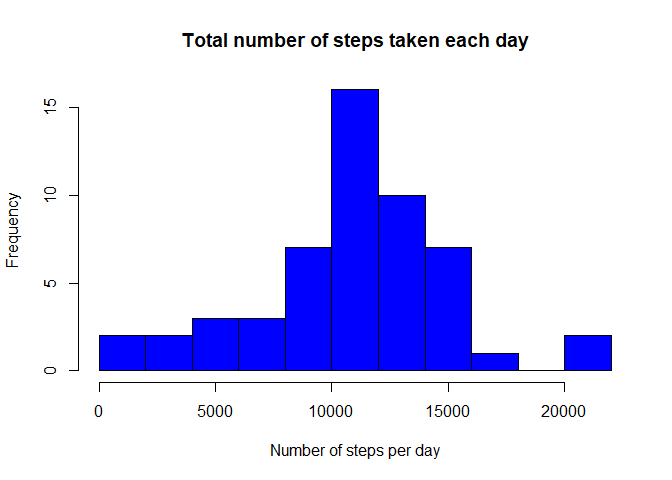
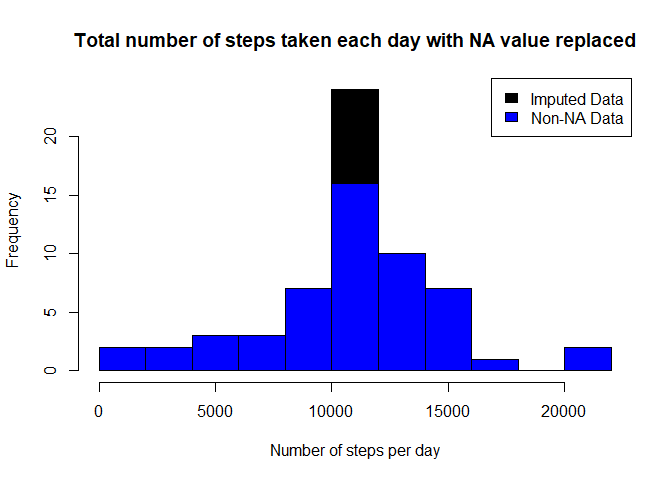
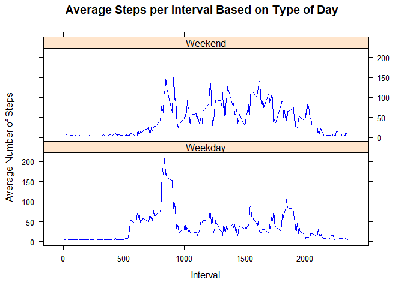

```r
library(knitr)
```

```
## Warning: package 'knitr' was built under R version 3.5.2
```

```r
library(ggplot2)
```

```
## Warning: package 'ggplot2' was built under R version 3.5.2
```

```r
library(plyr)
```

```
## Warning: package 'plyr' was built under R version 3.5.2
```

```r
library(lattice)
```

## Setting global values

```r
opts_chunk$set(echo=TRUE, results = "asis")
```


## Loading and preprocessing the data

```r
# Sets working directory to Coursera Assignment Directory
setwd("C:/Users/rober/Coursera/RepData_PeerAssessment1")

if (!file.exists("activity.csv") ) {
        unzip("activity.zip")
}
raw_data <- read.csv("activity.csv", header = TRUE)
raw_data$date <- as.Date(raw_data$date,format = "%Y-%m-%d")
raw_data$day <- weekdays(raw_data$date)
raw_data$daycategory <- ifelse(raw_data$day %in% c("Saturday", "Sunday"), "Weekend", "Weekday")
```


## What is mean total number of steps taken per day?

```r
# Calculate total steps per day
activitydata <- na.omit(raw_data)
stepsperday <- aggregate(activitydata$steps ~ activitydata$date, FUN=sum)
names(stepsperday) <- c("Date","Steps")


# Plot histogram of steps per day
hist(stepsperday$Steps, col = "blue", 
     breaks = 10,
     main = "Total number of steps taken each day",
     xlab = "Number of steps per day")
```

<!-- -->

```r
# Calculate mean and medium of steps per day
meanperday <- mean(stepsperday$Steps, na.rm = TRUE)
medianperday <- median(stepsperday$Steps, na.rm = TRUE)
```
The mean per day is 10766.19. The median per day is 10765.

## What is the average daily activity pattern?


```r
# Calculate average steps per interval
stepsperinterval <- ddply(activitydata, .(interval), summarize, Avg = mean(steps))

# Plot average steps per interval
ggplot(stepsperinterval, aes(x=interval, y=Avg), xlab = "Interval", ylab="Average Number of Steps") +
    geom_line()+xlab("Interval")+ylab("Average Number of Steps")+ggtitle("Average Number of Steps per Interval")
```

<!-- -->

```r
maxsteps  <- max(stepsperinterval$Avg)
print(maxsteps)
```

[1] 206.1698

```r
maxinterval <- stepsperinterval[stepsperinterval$Avg==maxsteps,1]
print(maxinterval)
```

[1] 835

The maximum number of steps for a 5-minute interval was 206 steps.

The 5-minute interval which had the maximum number of steps was the 835 interval.

## Imputing missing values

```r
countNAvals <- sum(is.na(raw_data$steps))
```
There are 2304 NA values in the raw dataset.

I will replace NA values with the mean value across the dataset.


```r
raw_data$steps[is.na(raw_data$steps)] = mean(raw_data$steps, na.rm=TRUE)
stepsperday_raw <- aggregate(raw_data$steps ~ raw_data$date, FUN=sum)
names(stepsperday_raw) <- c("Date","Steps")
stepsperday_raw$Date <- as.Date(stepsperday_raw$Date, format = "%Y-%m-%d")

hist(stepsperday_raw$Steps, col = "black", 
     breaks = 10,
     main = "Total number of steps taken each day with NA value replaced",
     xlab = "Number of steps per day")
hist(stepsperday$Steps, col="blue", add=T,
     breaks=10, 
     xlab="Number of steps per day", 
     main = "Total number of steps taken each day with NA value replaced")
legend("topright", c("Imputed Data", "Non-NA Data"), fill=c("black", "blue") )
```

<!-- -->

```r
# Calculate mean and medium of steps per day
meanperday_raw <- mean(stepsperday_raw$Steps, na.rm = TRUE)
medianperday_raw <- median(stepsperday_raw$Steps, na.rm = TRUE)
```

The mean and median of the total steps taken each day once the NAs are replaced.


```r
print(meanperday_raw)
```

[1] 10766.19

```r
print(medianperday_raw)
```

[1] 10766.19

The mean per day is 10766.19. The median per day is 10766.19. Note that both the mean and the median of the total steps taken each day after NAs are filled came out to be equal.

## Are there differences in activity patterns between weekdays and weekends?


```r
# Summarize data by interval and type of day
stepsperweekday <- ddply(raw_data, .(interval, daycategory), summarize, Avg = mean(steps))
xyplot(Avg~interval|daycategory, data=stepsperweekday, type="l",  layout = c(1,2), 
       col = "blue",
       main="Average Steps per Interval Based on Type of Day", 
       ylab="Average Number of Steps", xlab="Interval")
```

<!-- -->

There are differences. The step activity trends are different based on whether the day occurs on a weekend or a weekday. 
